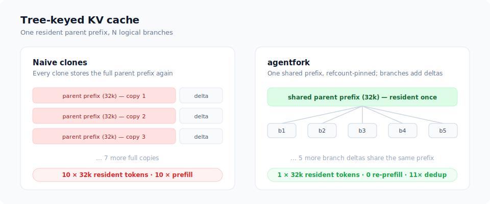
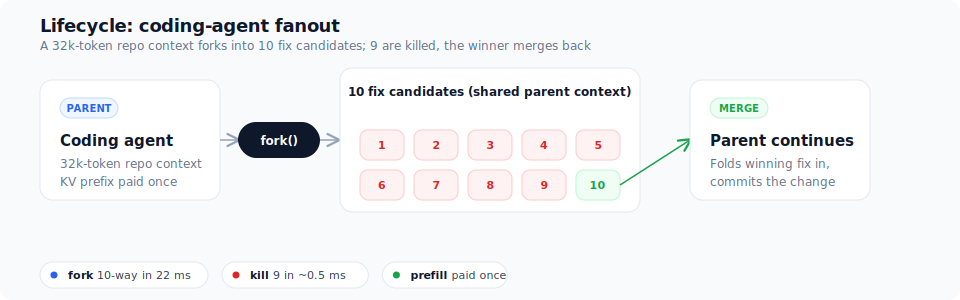

# agentfork

agentfork is a runtime for tree-style agent fanout.

It forks a live agent's sandbox and its LLM KV context together, as one
branch. Killing a branch reclaims both halves in <1ms, with no orphan
processes and no leaked KV pages.



**Measured at a glance:** 22 ms for 10 create+extend operations on an A10 ·
9.65× fewer KV slots than an explicitly unshared allocation · 1,080-line
additive SGLang patch set.

## What it does

agentfork implements two runtime operations, both given the same branch ID by
`ForkOrchestrator`:

- **`fork(parent)`** creates a child that shares the parent's cached context and
  runs in its own sandbox.
- **`kill(child)`** stops the sandbox and releases the child's KV state.

It is not an agent framework or a scheduler: it does not decide what an agent
does, only how a branch of it is created and torn down.

Out of the box, `ForkOrchestrator` uses the CPU reference cache
(`TreeKVCache`) and a no-op sandbox (`NullSandbox`), so you can run the KV
lifecycle with no GPU or VM; `ReaperSandbox` adds a real subprocess per
branch. Two heavier adapters plug into the same `KVBackend`/`SandboxBackend`
protocols:

- **`FirecrackerSandbox`** runs each branch in its own microVM, validated end
  to end on real hardware (`demo/fc_demo.py`): guest exec, writable overlays,
  per-branch networking, and the jailer.
- **`SGLangKVBackend`** (in-process) and **`SGLangHTTPBackend`** (over HTTP)
  fork the KV cache inside a patched SGLang engine. That request path was
  measured live on an A10G; the HTTP client is validated against a live
  server (`demo/sglang_tree_server.py` — real patched cache and auth, model
  forward stubbed on CPU), and `demo/integrated_demo.py` runs it together
  with a real sandbox under one orchestrator (see
  [report/RESULTS.md](report/RESULTS.md)).

Use it for:

- Cloud agent platforms that
  [map/reduce](https://github.com/sachinkesiraju/agent-mapreduce) one task
  across N parallel attempts: fork from one prepared context, keep the winner.
- Coding agents that try several fixes from one repository context.
- Verification trees that run cheap checks first and kill the failures before
  anything expensive runs.
- Search and planning agents that fork several next steps from the same state.
- Evaluations that reuse one cached context across policies or seeds.

## Example: tree-style agent fanout

A coding agent has read a 32k-token repository, reproduced a bug, and prepared
its build environment. It wants to try 10 fixes.

Forking the agent at that point gives each child the same cached context and
sandbox state, so each child pays only for its own fix. Cheap checks run
first, and branches that fail formatting, compilation, or focused tests are
killed immediately. Without forking, the agent would boot 10 cold sessions and
re-read the repository 10 times.

The strongest version is a tree, not a flat best-of-N batch: if two fixes
survive, fork each again for race tests, performance tests, or independent
review. Those grandchildren inherit the root context plus their candidate's
changes, and the full test suite runs only on the finalists.



The fanout cost changes from

```
N × (shared setup + branch work)
```

to

```
shared setup + sum(branch work)
```

Forking pays off when setup is expensive, branches are short, and most of them
are killed early. It pays off less when there are few branches or when most of
the work happens after the fork.

## Quickstart

Requires Python 3.10 or newer. The Firecracker sandbox needs Linux with
`/dev/kvm`; the SGLang KV backend needs a GPU host.

```bash
git clone https://github.com/sachinkesiraju/agentfork.git
cd agentfork
python -m venv .venv && source .venv/bin/activate
pip install -e ".[dev]"
tools/setup_sglang.sh   # patches SGLang for the KV backend; prints launch commands
```

The lifecycle is `create_parent` / `fork` / `kill_losers` over two production
backends: a Firecracker microVM per branch (`FirecrackerSandbox`, see
`demo/fc_demo.py`) and a shared KV cache in a patched SGLang engine. With the
server up, fork candidates from a shared prompt and keep the winner, with
inference (`generate`) as the data path:

```python
from agentfork import ForkOrchestrator, SGLangHTTPBackend

kv = SGLangHTTPBackend(
    "https://sglang.example.internal", admin_api_key="admin-secret")
with ForkOrchestrator(kv=kv, registry_path="branches.json") as orch:
    orch.create_parent("parent")
    orch.generate("parent", "Shared context", {"max_new_tokens": 4})

    children = orch.fork("parent", n=3)  # three candidates from one prompt
    for child in children:
        orch.generate(child.branch_id, "Shared context\nCandidate:",
                      {"max_new_tokens": 64}, reserve_tokens=64)

    orch.kill_losers(children[0].branch_id)  # keep the winner, drop the rest
```

Run `pytest -q` to execute the test suite.

## How it works

`ForkOrchestrator` gives the sandbox and KV branch one ID, backed by a
single-owner, fsynced registry: it rolls back partial forks, retries
interrupted cleanup, and bounds every branch with a lease.

Forking a KV branch just adds a reference count along the shared prefix; no
tokens are copied. Each branch runs as an ordinary subprocess. Killing a
branch stops that subprocess with a Linux `pidfd` and releases its cache
entry; together that takes 0.53 ms (median).

Two production backends plug into the same orchestrator, one for each half of
a branch:

1. **KV cache fork** (SGLang patches `0001`–`0002`). A branch ID rides
   SGLang's normal request path, so forking, killing, and per-branch quotas
   happen inside the engine with no tokens copied. Use it in-process
   (`SGLangKVBackend`) or over HTTP (`SGLangHTTPBackend`). On a Modal A10G, ten
   children each reused all 2,406 of the parent's cached tokens, and killing
   one freed its share.
2. **Sandbox fork** (`FirecrackerSandbox`). A branch is snapshotted only when
   first forked, so children start from the parent's live state and unforked
   branches cost nothing (snapshot pauses the parent 76–83 ms; each child
   restores in about 2 ms). Each guest runs commands over vsock
   (`exec`/`exec_detached`), gets a private writable disk, an optional jailer
   lockdown, and its own network with outbound internet. Verified on real
   Firecracker v1.16.1: children run commands, write their own disks, keep
   state the parent set after boot, and reach the internet, jailed and not.

```
ForkOrchestrator  (registry / leases / rollback / reconcile)
        │
        ▼
   coordinated branch ID
   │
   ├── KV branch
   │    ├── TreeKVCache            CPU reference cache (live)
   │    └── TreeRadixCache patch   via SGLangKVBackend / SGLangHTTPBackend
   │
   └── sandbox branch
        ├── ReaperSandbox          pidfd subprocess (live)
        └── Firecracker microVMs   via FirecrackerSandbox (live: exec, stdin,
                                   overlays, networking, jailer)
```

"Fork" here is not Linux `fork(2)`: CUDA state cannot be duplicated by forking
a process, so nothing in agentfork relies on that. The KV fork is a logical
reference count on shared KV slots inside the cache, not a copy of GPU memory.
Firecracker's copy-on-write is a separate mechanism that shares a VM's guest
memory pages between snapshot and restore; it does not touch CUDA memory
either.

## Measured results

See [report/RESULTS.md](report/RESULTS.md) for full results, assumptions, and
the checks that fail or remain untested.

| What we tested | Result |
|---|---|
| Branches share KV cache on a real GPU (A10) | 10 branches sharing a 32k-token prefix fit in 37k slots instead of the 357k that separate copies would need, and killing them returns the pool to zero. |
| Children reuse the parent's tokens on a real GPU (A10G) | All 10 children reused the parent's 2,406 cached tokens with no re-prefill; killing a child released its hold on the cache. |
| Fork a sandbox on real Firecracker | 5 children forked in 28–145 ms each, every one with a working shell, its own writable disk, and no leaked VMs. |
| Kill a losing branch (CPU reference path) | 0.53 ms median, 1.46 ms worst case, over 100 kills. |
| Forked children reach the network (Firecracker) | Two children each loaded example.com over their own isolated network; teardown left no leftover routes. |
| Children generate faster under cache pressure (A10G, vs stock SGLang) | When background traffic evicts the shared prefix from stock but not from agentfork, children run 1.5–1.6× faster across two synthetic runs. Partner validation still pending. |

Grounding: forking a whole branch, its sandbox microVM plus its KV cache,
runs 28–145 ms per child, and the KV cache is under 1.3% of that. That puts
it in the same class as managed providers that fork only the sandbox
([Morph](https://cloud.morph.so/docs/developers) branches a full VM in under
250 ms). Forking the KV cache too is what lets a fanout reuse the shared
prompt instead of re-prefilling it in every child.

## Running benchmarks

```bash
pytest -q
python demo/demo.py
python -m agentfork.bench.kill_bench --cycles 100
python -m agentfork.bench.crash_bench --cycles 50 --children 5
python -m agentfork.bench.cost_model --children 10 --prefix 32000 --suffix 2000

# Direct SGLang cache validation:
export SGLANG_DIR=/path/to/sglang
git -C "$SGLANG_DIR" checkout 40517b593b23870cf351a05a1d53e930cea6a58d
git -C "$SGLANG_DIR" apply "$PWD/patches/0001-sglang-tree-radix-cache.patch"
git -C "$SGLANG_DIR" apply "$PWD/patches/0002-Wire-branch-lifecycle-through-the-SGLang-request-pat.patch"
git -C "$SGLANG_DIR" apply "$PWD/patches/0003-Harden-tree-request-auth-and-accounting.patch"
PYTHONPATH="$SGLANG_DIR/python" python patches/real_pool_validation.py
PYTHONPATH="$SGLANG_DIR/python" python patches/scale_10k_branch_validation.py
PYTHONPATH="$SGLANG_DIR/python" python patches/tree_native_features_validation.py

# Firecracker (requires /dev/kvm, Firecracker, a guest kernel, and a rootfs):
python -m agentfork.sandbox.fc_bench --fc ./firecracker --kernel vmlinux --rootfs rootfs.ext4
python demo/fc_demo.py --fc ./firecracker --kernel vmlinux --rootfs rootfs.ext4  # full lifecycle through ForkOrchestrator

# GPU validation (requires Modal and the patched SGLang checkout):
pip install modal
SGLANG_DIR="$SGLANG_DIR" modal run modal_gpu_validation.py
```

## Limitations

- SGLang is measured on only one A10G/0.6B; scale, tensor parallelism, and
  multi-tenant pressure need a GPU fleet. The live HTTP server path is
  validated (real patched cache, auth, lifecycle), but with the transformer
  forward stubbed — a real GPU forward over HTTP remains unrun.
- Firecracker is single-host: moving migration bundles between hosts is the
  deployer's job, and cleanup is retried, not atomic.
- Nothing is validated at production GPU scale or with GPU-plus-microVM
  colocation.
- `ReaperSandbox` runs spawns serially by default; `pdeathsig="shim"` fans
  them out.
- Single-winner handoff exists (`export_artifact`); multi-winner merge does
  not.

## Why agentfork vs. alternatives

Every branch in an agent tree has two halves: a sandbox where the agent works
and a KV cache that holds its context. The two must fork and be freed together,
or a child's environment and its memory fall out of sync. Existing tools branch
only one half, leaving you to pair each VM with its cache and reclaim both by
hand, with two places a branch can leak.

agentfork gives both halves one branch ID. A child comes up warm on both sides
at once (28–145 ms, the KV fork under 1.3% of that), so it thinks and acts
right away instead of stalling on a cold VM or re-prefilling the shared prompt.
That prompt is prefilled once and reused by reference across children, and a
kill frees the VM and GPU cache together, so nothing leaks.

| Project | What it does | What's missing |
|---|---|---|
| [forkd](https://github.com/deeplethe/forkd) | Forks microVMs from a shared snapshot, copy-on-write | A branch ID that also owns and reclaims the LLM KV cache |
| [SGLang](https://github.com/sgl-project/sglang) RadixAttention, [vLLM](https://github.com/vllm-project/vllm) APC | Automatically reuses KV for requests sharing a prefix | Explicit agent-tree ownership, branch policy, and sandbox coordination |
| [LMCache](https://github.com/LMCache/LMCache), [Mooncake](https://github.com/kvcache-ai/Mooncake), [Dynamo](https://github.com/ai-dynamo/dynamo) | Moves and tiers KV cache across memory and workers | Branch identity and sandbox coordination on top of that movement |
| **agentfork** | Forks a sandbox and its KV cache under one branch ID, and reclaims both on kill | GPU forward over HTTP, multi-worker routing, and hosting it as a service |

## License

Apache-2.0. See [LICENSE](LICENSE).
