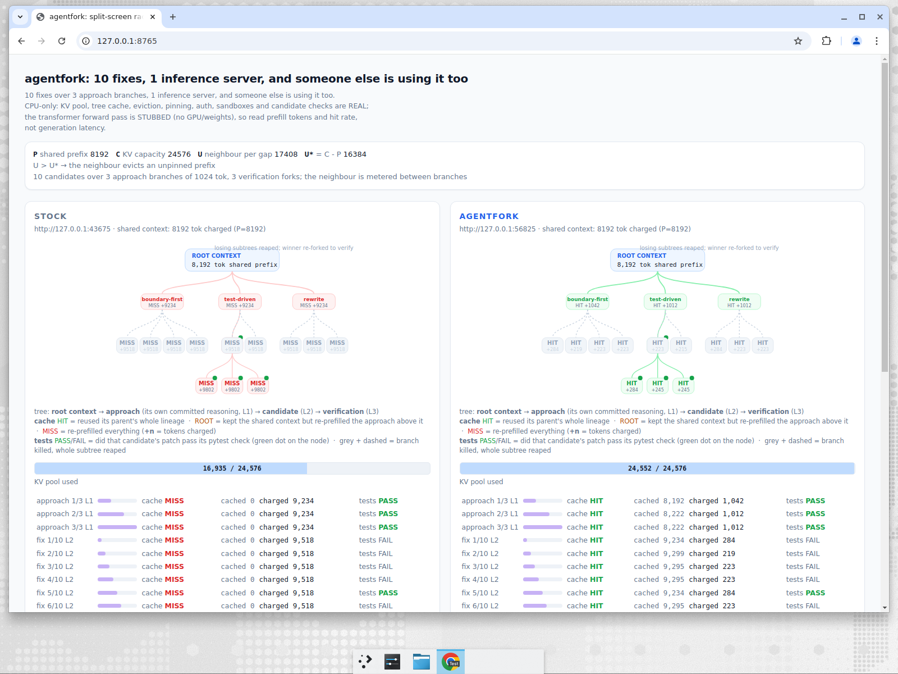

# Split-screen race demo: captured run (CPU)

`demo/race_demo.py` -- *10 fixes, 1 inference server, and someone else is using it too.*

Two arms solve the same planted bug against the same live tree-cache HTTP
server, one after the other, each against a freshly started server so neither
inherits the other's cache. An unrelated tenant streams traffic through that
server between candidates.

## What is real and what is not

This box has no GPU and no model weights, so **the transformer forward pass is
stubbed**. Everything the demo measures is real:

| real | stubbed |
| --- | --- |
| KV pool + allocator (`MHATokenToKVPool`, `TokenToKVPoolAllocator`) | the generated text |
| `TreeRadixCache`: prefix matching, charge accounting, `lock_ref` pinning, LRU eviction | generation latency |
| branch lifecycle (`create`/`fork`/`kill`/`demote`) over HTTP with admin auth | |
| the noisy neighbour's requests (real prefills through the same pool) | |
| sandboxes (`ReaperSandbox`, real subprocesses) and candidate checks (real `pytest` runs) | |

So the headline numbers are **prefill tokens charged** and the
**parent-prefix hit rate**, which are the cache's own measurements. Wall clock
is reported but is *not* a model-speed claim: with a stubbed forward pass it
mostly measures HTTP, `pytest` and process spawning.

`/dev/kvm` and a Firecracker binary/kernel/rootfs were not available on this
box, so the sandbox is `ReaperSandbox`. No Firecracker output is reported.

## Environment

* 2 vCPU / 7 GiB Linux 5.15 container, no GPU
* torch 2.13.0+cpu, patched SGLang @ `40517b593` + the three tree-cache patches
* repo at `73f7d53`

## Commands

```bash
python3 -m venv .venv && .venv/bin/pip install -e ".[dev]"
tools/setup_sglang.sh ~/sglang

# the demo: live browser dashboard on http://127.0.0.1:8765
PYTHONPATH=~/sglang/python .venv/bin/python demo/race_demo.py

# headless: plain log + machine-readable JSON summary (tests and CI use this)
PYTHONPATH=~/sglang/python .venv/bin/python demo/race_demo.py --no-ui
```

Defaults: `N=10` candidates spread over `M=3` **approach** branches of
`A=1024` tokens each, `P=8192` shared-prefix tokens, `S=256` unique tokens per
candidate, `C=24576` KV pool tokens, neighbour requests of 1024 tokens metered
so that `U = 17408` tokens land between consecutive branches.

The tree is four levels deep, which is the point:

```text
root context (P=8192, shared)
  +- approach "boundary-first"  (A=1024 tokens of its own committed reasoning)
  |    +- candidate  (S) ... x4     <- inherits root *and* this approach
  +- approach "test-driven"
  |    +- candidate  (S) ... x3
  |         +- verification fork x3   <- inherits the whole winning lineage
  +- approach "rewrite"
       +- candidate  (S) ... x3
```

A leaf therefore has two different ways to win: it can reuse the shared root
context (`cache ROOT`), or reuse *everything its lineage committed* including
its approach's reasoning (`cache HIT`, the full-lineage/subtree hit). The
demo reports both rates separately, because only the second one says the
subtree survived. `--approaches` / `--approach-tokens` reshape the tree.
`U* = C - P = 16384`, so `U > U*`: the break-even model in
`agentfork/bench/cost_model.py` predicts the stock prefix cannot survive and
the pinned one must.

## Browser dashboard (the demo)

```bash
PYTHONPATH=$HOME/sglang/python python3 demo/race_demo.py    # http://127.0.0.1:8765
```

The race renders itself in the browser: a stdlib `ThreadingHTTPServer` serves
one self-contained HTML page and streams the race over server-sent events
(`demo/race_web.py`), so there is no build step and no new dependency.

Each arm draws its **branch tree live**, in the same visual language as
`docs/img/lifecycle.svg`, at the full depth of the run: the root context node,
the approach branches under it, the candidates under those, and the
verification forks under the surviving winner. Siblings are spaced so each
subtree is visibly its own group. A node is coloured by *what it managed to
reuse*:

| node | meaning |
| --- | --- |
| green `HIT` | reused its parent's whole lineage -- root context *and* the approach reasoning above it |
| amber `ROOT` | kept the shared root context but re-prefilled the approach above it (a partial subtree hit) |
| red `MISS` | nothing survived; re-prefilled from scratch |
| green dot | that branch's `pytest` check passed |
| grey + dashed | killed as a loser, with its whole subtree reaped |

`+n` under a node is the tokens it was actually charged. Below the tree: live
KV bars per arm, one row per branch tagged with its level (`L1` approach, `L2`
candidate, `L3` verification) and its `cache`/`tests` result, the kill event,
and the scoreboard at the end. A browser that connects late gets the whole race
replayed, and the server stays up after the race so the result stays readable.



## Scoreboard (same run)

```text
metric                                             STOCK           AGENTFORK
----------------------------------------------------------------------------
root-context hit rate                                 0%                100%
full-lineage (subtree) hit rate                       0%                100%
prefill tokens charged (real)                    160,480              14,433
peak KV pool used                                 17,669              24,552
KV released when losers died                           0               4,141
KV still pinned after the kills                        0               9,802
sandbox setup (s, total)                            0.48                0.03
wall clock (s)* -- not a speed claim                 3.8                 3.3
verified winner                        stock/root/2/8/14  agentfork/root/2/8/14
neighbor requests served                             289                 289
neighbor requests deferred                             0                   0

* the forward pass is stubbed, so wall clock here is mostly HTTP, pytest and process spawning:
  the gap between the arms is noise, not a speedup. The headline numbers are prefill tokens
  charged and the parent-prefix hit rate, which the cache measures for real.
Note: the stock arm also releases KV when its branches die -- but those were ordinary
evictable pages that the neighbour had already been recycling; it had nothing pinned to
protect, which is exactly why its shared prefix did not survive to the next candidate.
```

**11.1x fewer prefill tokens charged** (160,480 -> 14,433) for the same work,
same server, same neighbour, and the same verified fix -- and the gap is wider
than a flat fan-out's, because the stock arm re-prefills each approach's
reasoning as well as the shared context. Note the wall clock: the two arms are
within noise of each other (3.8 s vs 3.3 s). With the forward pass stubbed
there is no generation time for a cache hit to save, so that column is not the
headline.

## `--no-ui` log (same defaults, separate run)

```text
--- STOCK arm: fresh server at http://127.0.0.1:33709 ---
[stock] shared context prefilled: 8192 tokens charged (P=8192)
[stock/approach 1/3] stock/root/1: depth=1 cached=0 charged=9234 cache=miss sandbox_setup=31ms check=PASS
[stock/approach 2/3] stock/root/2: depth=1 cached=0 charged=9234 cache=miss sandbox_setup=29ms check=PASS
[stock/approach 3/3] stock/root/3: depth=1 cached=0 charged=9234 cache=miss sandbox_setup=30ms check=PASS
[stock/fix 1/10] stock/root/1/4: depth=2 cached=0 charged=9518 cache=miss sandbox_setup=29ms check=fail
[stock/fix 2/10] stock/root/1/5: depth=2 cached=0 charged=9518 cache=miss sandbox_setup=30ms check=fail
[stock/fix 3/10] stock/root/1/6: depth=2 cached=0 charged=9518 cache=miss sandbox_setup=29ms check=fail
[stock/fix 4/10] stock/root/1/7: depth=2 cached=0 charged=9518 cache=miss sandbox_setup=30ms check=fail
[stock/fix 5/10] stock/root/2/8: depth=2 cached=0 charged=9518 cache=miss sandbox_setup=30ms check=PASS
[stock/fix 6/10] stock/root/2/9: depth=2 cached=0 charged=9518 cache=miss sandbox_setup=32ms check=fail
[stock/fix 7/10] stock/root/2/10: depth=2 cached=0 charged=9518 cache=miss sandbox_setup=30ms check=fail
[stock/fix 8/10] stock/root/3/11: depth=2 cached=0 charged=9518 cache=miss sandbox_setup=30ms check=fail
[stock/fix 9/10] stock/root/3/12: depth=2 cached=0 charged=9518 cache=miss sandbox_setup=29ms check=fail
[stock/fix 10/10] stock/root/3/13: depth=2 cached=0 charged=9518 cache=miss sandbox_setup=30ms check=fail
[stock] killed 11 loser branch(es): KV freed=0 tokens, pool used dropped by 0
[stock/verify 1/3] stock/root/2/8/14: depth=3 cached=0 charged=9802 cache=miss sandbox_setup=30ms check=PASS
[stock/verify 2/3] stock/root/2/8/15: depth=3 cached=0 charged=9802 cache=miss sandbox_setup=30ms check=PASS
[stock/verify 3/3] stock/root/2/8/16: depth=3 cached=0 charged=9802 cache=miss sandbox_setup=29ms check=PASS
[stock] done in 3.8s: hit_rate=0.00 prefill_charged=160480 peak_kv=17669 verified=True

--- AGENTFORK arm: fresh server at http://127.0.0.1:39249 ---
[agentfork] shared context prefilled: 8192 tokens charged (P=8192)
[agentfork/approach 1/3] agentfork/root/1: depth=1 cached=8192 charged=1042 cache=subtree sandbox_setup=0ms check=PASS
[agentfork/approach 2/3] agentfork/root/2: depth=1 cached=8222 charged=1012 cache=subtree sandbox_setup=0ms check=PASS
[agentfork/approach 3/3] agentfork/root/3: depth=1 cached=8222 charged=1012 cache=subtree sandbox_setup=0ms check=PASS
[agentfork/fix 1/10] agentfork/root/1/4: depth=2 cached=9234 charged=284 cache=subtree sandbox_setup=0ms check=fail
[agentfork/fix 2/10] agentfork/root/1/5: depth=2 cached=9299 charged=219 cache=subtree sandbox_setup=0ms check=fail
[agentfork/fix 3/10] agentfork/root/1/6: depth=2 cached=9295 charged=223 cache=subtree sandbox_setup=0ms check=fail
[agentfork/fix 4/10] agentfork/root/1/7: depth=2 cached=9295 charged=223 cache=subtree sandbox_setup=0ms check=fail
[agentfork/fix 5/10] agentfork/root/2/8: depth=2 cached=9234 charged=284 cache=subtree sandbox_setup=0ms check=PASS
[agentfork/fix 6/10] agentfork/root/2/9: depth=2 cached=9295 charged=223 cache=subtree sandbox_setup=0ms check=fail
[agentfork/fix 7/10] agentfork/root/2/10: depth=2 cached=9303 charged=215 cache=subtree sandbox_setup=0ms check=fail
[agentfork/fix 8/10] agentfork/root/3/11: depth=2 cached=9234 charged=284 cache=subtree sandbox_setup=0ms check=fail
[agentfork/fix 9/10] agentfork/root/3/12: depth=2 cached=9295 charged=223 cache=subtree sandbox_setup=0ms check=fail
[agentfork/fix 10/10] agentfork/root/3/13: depth=2 cached=9295 charged=223 cache=subtree sandbox_setup=0ms check=fail
[agentfork] killed 11 loser branch(es): KV freed=4141 tokens, pool used dropped by 4141
[agentfork/verify 1/3] agentfork/root/2/8/14: depth=3 cached=9518 charged=284 cache=subtree sandbox_setup=0ms check=PASS
[agentfork/verify 2/3] agentfork/root/2/8/15: depth=3 cached=9557 charged=245 cache=subtree sandbox_setup=0ms check=PASS
[agentfork/verify 3/3] agentfork/root/2/8/16: depth=3 cached=9557 charged=245 cache=subtree sandbox_setup=0ms check=PASS
[agentfork] done in 3.3s: hit_rate=1.00 prefill_charged=14433 peak_kv=24552 verified=True
```

`cache=subtree` is the interesting one: an agentfork candidate at depth 2 is
cached `9,234` tokens -- the `8,192`-token root context *plus* its approach's
`1,042` tokens -- and charged only its own `284`. The stock arm is charged
`9,518` for every candidate because the neighbour has evicted the whole
lineage, approach reasoning included.

### Machine-readable summary (excerpt)

The `--no-ui` run ends with a JSON object between
`===RACE_DEMO_JSON_BEGIN===` / `===RACE_DEMO_JSON_END===`:

```json
{
  "claims": {
    "agentfork_parent_hit_rate": 1.0,
    "stock_parent_hit_rate": 0.0,
    "agentfork_subtree_hit_rate": 1.0,
    "stock_subtree_hit_rate": 0.0,
    "agentfork_prefill_charged": 14433,
    "stock_prefill_charged": 160480,
    "agentfork_verified": true,
    "stock_verified": true,
    "agentfork_kv_freed_by_kills": 4141,
    "agentfork_pinned_after_kills": 9802,
    "agentfork_expected_pinned_after_kills": 9802
  }
}
```

### Measured vs. predicted

The demo also emits the cost model's prediction for the same `(P, N, S, U, C)`:

| | model | measured |
| --- | --- | --- |
| stock parent hit rate | 0.0 | 0.0 |
| pinned parent hit rate | 1.0 | 1.0 |
| stock prefill charged | 92,672 | 160,480 |
| pinned prefill charged | 10,752 | 14,433 |

The model counts only a flat fan-out round; the measured numbers also include
the parent prefill, the 3 approach branches and the 3-fork verification round,
which is why they are higher.
The hit rates -- the thing the break-even math actually predicts -- match
exactly.

## Boundary check (`U <= C - P`)

The advantage is a property of the pressure, not of the framing. Below the
break-even both arms keep the prefix, and `tests/test_race_demo.py` asserts
exactly that (`--noise-requests-per-gap 1`): stock hit rate 1.0, agentfork hit
rate 1.0. Pinning only wins where the model says it wins.

### ... but `U* = C - P` only covers the *root*

Making the tree deep exposed a sharper boundary, and the tests now assert it.
Below the classic break-even the stock arm keeps the shared root context on
every candidate -- and *still* loses subtrees: measured `stock` root hit rate
`1.0` with full-lineage hit rate `0.33`, i.e. two of three candidates were
charged again for their approach's reasoning. Keeping a whole lineage unpinned
needs headroom for the root *plus every sibling subtree at once*; when that
does not fit, the cache's LRU drops the older approaches. Give it that room
(`--capacity-tokens 6144 --noise-requests-per-gap 1`) and the stock arm ties at
`1.0` -- so this is capacity and LRU, not framing. The pinned arm is `1.0` in
all three regimes, because `lock_ref` does not care how much room is left.

## Tests

```text
$ PYTHONPATH=~/sglang/python .venv/bin/python -m pytest -q tests/test_race_demo.py
........                                                                 [100%]
11 passed in 44.90s

$ PYTHONPATH=~/sglang/python .venv/bin/pytest -q
244 passed, 2 skipped in 68.08s

$ .venv/bin/ruff check agentfork demo tests
All checks passed!
```

Without the patched SGLang checkout on `PYTHONPATH` the race-demo tests skip
(they need the real cache); the rest of the suite is unaffected.

## Reproducibility

Three consecutive `--no-ui` runs gave bit-identical hit rates and prefill
charges (`1.0 / 0.0`, `14,433 / 160,480`); only wall clock and sandbox setup
times varied. The candidates come from the deterministic `FakeLLM` and the
neighbour is metered, so the cache measurements are stable.

## Caveats

* The dashboard is the only UI: there is no terminal renderer. `--no-ui` is
  the headless path (log + JSON) and is what CI runs; it needs no browser.
* Wall clock is noise here: the two arms land within a few hundred
  milliseconds of each other while agentfork charges 11.1x fewer prefill
  tokens. With a stubbed forward pass there is no generation time for a cache
  hit to save (an earlier flat-tree capture had agentfork *slower*, 4.7 s vs
  3.6 s).
* On this 2-vCPU box the whole race takes ~8 s rather than the ~60-90 s a
  human-paced demo wants: with a stubbed forward pass there is no generation
  time to spend. Scale it with `--children`, `--prefix-tokens` and
  `--noise-request-tokens` if you want a longer run; nothing is padded
  artificially.
* The neighbour is *metered* (`gap()` admits exactly `U` tokens between
  candidates) rather than free-running, so the interleaved token count is
  exact and the comparison against `U* = C - P` is meaningful in both
  directions.
* `charged`/`cached` counts are byte-level tokens: the demo server tokenizes
  UTF-8 bytes because there is no tokenizer to load without weights.

---

# Real GPU, real weights: the same race on an A10 (Modal)

Everything above runs on CPU with the forward pass stubbed. `modal_race_demo.py`
runs the same race against a real `sgl.Engine` serving **Qwen3-0.6B on an
NVIDIA A10**, so prefill, decode and wall clock are model measurements rather
than HTTP overhead.

```bash
SGLANG_DIR=/path/to/patched/sglang python3 -m modal run modal_race_demo.py
```

Captured 2026-07-29 (full JSON: [gpu_race_run.json](gpu_race_run.json)):

```
GPU NVIDIA A10   model Qwen/Qwen3-0.6B
C = 49,152   P = 12,725 (measured with the real tokenizer)
U* = C - P = 36,427      U = 37,327 injected between every candidate
```

| metric | stock | agentfork |
|---|---|---|
| parent-prefix hit rate | 0% | 100% |
| prefill tokens charged | 43,142 | 158 |
| generation time, 13 branches (real decode) | 8.67 s | 6.55 s |
| median per-candidate latency | 0.63 s | 0.50 s |
| KV reclaimed by killing 9 losers | n/a | 399 tok (their suffixes; the parent stays pinned) |
| verified winning fix | yes | yes |

**273x fewer prefill tokens and a real 1.32x end-to-end generation speedup** --
the CPU demo could only measure the first of those. Per-candidate detail shows
what the stock arm is actually doing: it is not missing entirely, it is
*partially* re-prefilling, because the neighbour keeps trimming the shared
prefix from the tail (`child-0` cached 8,192 of 12,758 tokens, `child-1` only
6,144, `child-2` 10,240 -- never the whole prefix). The agentfork children
cached 12,729-12,749 of the same prompts and were charged 9-29 tokens each.

Honest notes:

* The *patch* each branch proposes is still the deterministic candidate list,
  because Qwen3-0.6B does not reliably write a correct fix; the model genuinely
  generates on each branch's prompt, and the script separately checks what it
  wrote and reports it as `model_generated_fix_passed` (0/13 in this run, 1/13
  in an earlier smaller run -- reported, never folded into the race result).
* The speedup depends on `P` relative to decode length: with `MAX_NEW = 32`
  most of each request is prefill, which is exactly the regime a fan-out
  workload lives in. A shorter context shrinks it -- an earlier run at
  `P = 1,385` measured 1.04x while still showing 118x fewer prefill tokens.
* The agentfork arm's parent prefill is slower (3.23 s vs 0.59 s) because it
  also commits and pins the branch; it is paid once and amortised over 13
  children.
